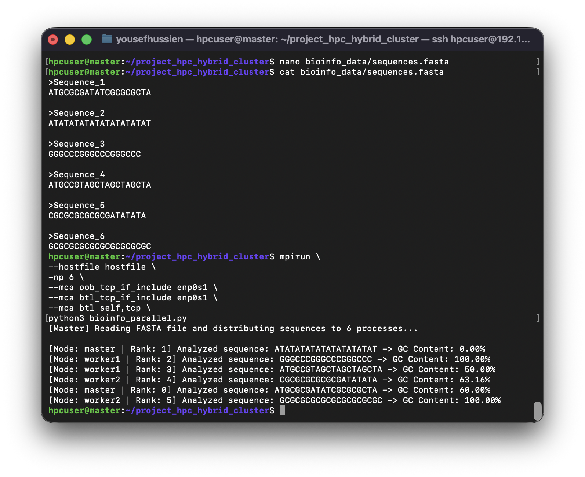

# Hybrid HPC and Big Data Cluster for Bioinformatics Applications

## Project Overview

This project presents the design and implementation of a Hybrid High Performance Computing (HPC) and Big Data Cluster environment using OpenMPI, Docker Swarm, Apache Spark, and Python.

The infrastructure consists of one master node and two worker nodes running Ubuntu Linux virtual machines. The cluster supports distributed computing workloads, machine learning tasks, and bioinformatics applications through parallel execution and scalable resource management.

The project is divided into two main phases:

### Task 1 – Mini HPC Cluster
- Passwordless SSH configuration
- OpenMPI installation and validation
- MPI Hello World execution
- Distributed Machine Learning using the Digits dataset
- Parallel Bioinformatics sequence analysis

### Task 2 – Hybrid HPC + Big Data Cluster
- Docker Swarm deployment
- Apache Spark cluster setup
- Distributed Gene Expression Analysis using PySpark

The goal of this project is to demonstrate how modern HPC and Big Data technologies can be integrated to solve computationally intensive problems in bioinformatics and data science.


The cluster consists of three nodes:

- Master Node
- Worker Node 1
- Worker Node 2

---

# 1. Network Configuration

The first step was configuring the cluster network and hostname resolution across all nodes.


Cluster connectivity was then verified between all nodes.


---

# 2. SSH Configuration

Passwordless SSH access was configured from the master node to Worker 1.


Passwordless SSH access was also configured to Worker 2.


---

# 3. OpenMPI Installation and Validation

OpenMPI was installed on all nodes.


A shared hostfile was then configured.


MPI communication was validated using a simple Hello World application.


Python MPI support (mpi4py) was verified successfully.


---

# 4. Docker Swarm Cluster Deployment

Docker was installed on all cluster nodes.


A Docker Swarm manager node was initialized.


Worker1 joined the Swarm cluster.


Worker2 joined the Swarm cluster.


The cluster nodes were successfully registered.


---

# 5. Apache Spark Deployment

A Spark stack configuration file was prepared for deployment.


## Deployment Issue Encountered

During deployment, an image-related issue was encountered.


The configuration was corrected and deployment was attempted again.


The Spark cluster was then successfully deployed.


The Spark Web UI confirmed that all services were operational.


Spark Master Web Interface:
A screenshot of the Apache Spark Master Web UI accessed through the browser. The interface confirms the successful deployment of the Spark cluster on Docker Swarm and displays the active Spark Master service along with the cluster monitoring dashboard.

---

# 6. Distributed Gene Expression Analysis using Spark

PySpark was installed and configured.


The leukemia gene expression dataset was prepared.


A distributed PySpark analysis script was created.


The model was executed successfully and produced classification results.


Result:

- Logistic Regression Classification
- Distributed Spark Execution
- Accuracy = 100%

---

# 7. Distributed Bioinformatics Analysis using MPI

A FASTA dataset containing DNA sequences was distributed across multiple MPI processes.

The application calculated GC Content in parallel across the cluster nodes.



The experiment utilized six MPI processes across the cluster infrastructure, enabling concurrent analysis of DNA sequences. The successful execution on multiple nodes verified inter-node communication, workload distribution, and the effectiveness of MPI for bioinformatics applications.


Features:

- MPI Scatter Distribution
- Multi-node Execution
- Parallel DNA Sequence Analysis
- GC Content Calculation

---

# Source Files

```text
bioinfo_parallel.py
distributed_gene_expression_analysis.py
distributed_mnist.py
test_mpi.py
spark-stack.yml
hostfile
```

# Datasets

```text
bioinfo_data/
├── sequences.fasta
└── leukemia_expression.csv
```

# Technologies Used

- Ubuntu Linux
- OpenMPI
- mpi4py
- Python
- Scikit-Learn
- Docker
- Docker Swarm
- Apache Spark
- PySpark

# Learning Outcomes

This project provided practical experience in:

- HPC Cluster Deployment
- Distributed Computing
- Parallel Machine Learning
- Bioinformatics Analysis
- Docker Orchestration
- Apache Spark Deployment
- Hybrid HPC and Big Data Integration

# Conclusion

This project successfully demonstrated the deployment of a Hybrid HPC and Big Data Cluster using three Ubuntu-based virtual machines configured as one master node and two worker nodes.

The HPC environment was validated through OpenMPI-based parallel applications, including distributed machine learning and bioinformatics workloads. The successful execution of MPI jobs across multiple nodes confirmed proper cluster communication and workload distribution.

In the second phase, Docker Swarm and Apache Spark were deployed to extend the cluster toward Big Data processing capabilities. The Spark environment provided a scalable framework for distributed analytics and machine learning applications.

Overall, the project highlights the importance of combining High Performance Computing and Big Data technologies to address modern computational challenges in bioinformatics and scientific research. Future improvements may include larger cluster deployments, cloud integration, GPU acceleration, and advanced genomic analysis pipelines.
